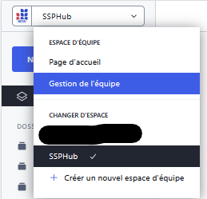
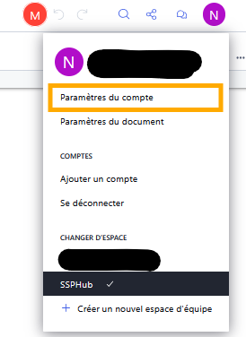
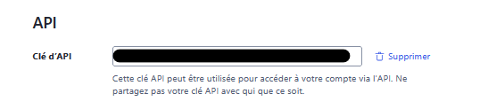
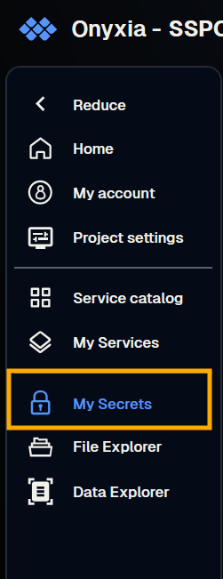
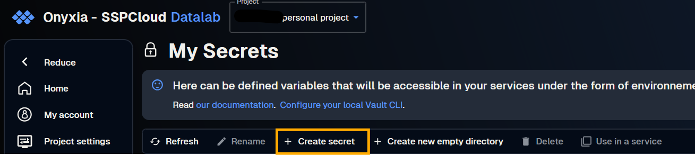
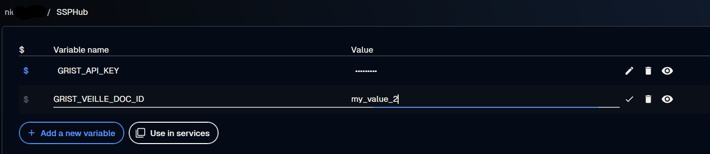
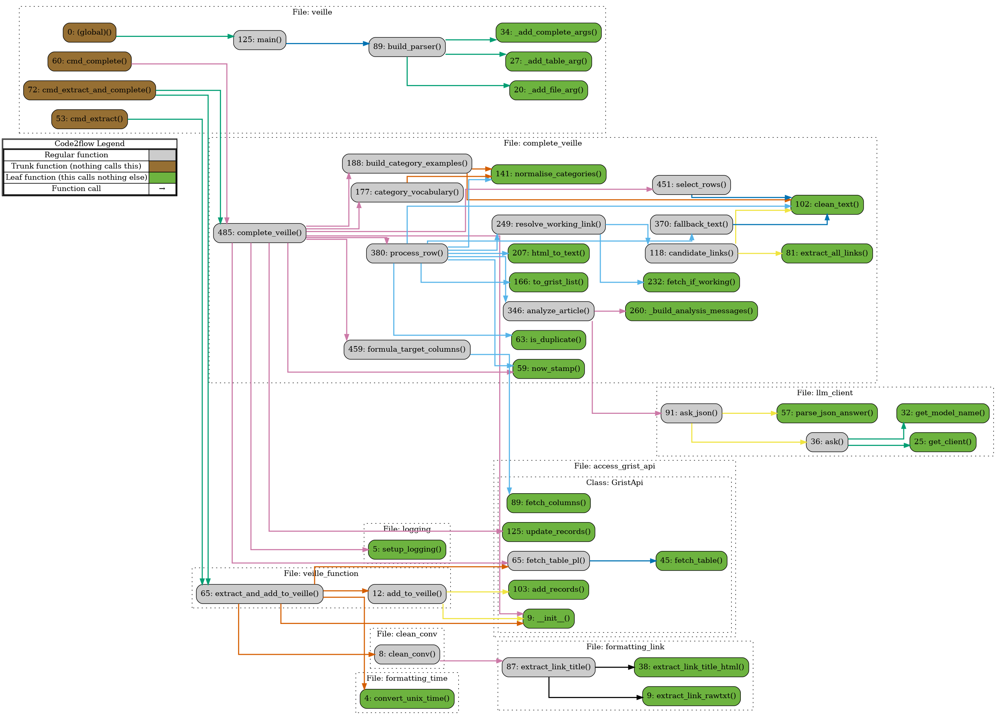

# ssphub_veille

Tooling to build the **SSPHub veille** (the curated watch that feeds the
[newsletter](https://ssphub.netlify.app/infolettre/)). It is a two-stage
pipeline around a Grist *Veille* table:

1. **Extract** — read a Tchap conversation export and add the article links it
   contains as new rows in the Grist table.
2. **Complete** — for each row, use an LLM to fill in the article **title**, a
   short **summary** and one or more **categories**.

Both stages are driven from a single command-line tool, `veille.py`, and are
meant to run on [SSPCloud / Onyxia](https://datalab.sspcloud.fr/).

## Pipeline at a glance

```
 Tchap conversation                Grist "Veille" table                 Grist "Veille" table
   (export.json)   ──[ extract ]──▶   + new rows (link, date)  ──[ complete ]──▶  title, summary,
                                       Traitement = empty                          category filled
```

| Command | What it does |
| --- | --- |
| `uv run veille.py extract` | Tchap export → new rows in Grist (links only). |
| `uv run veille.py complete` | Fill title/summary/category on rows whose `Traitement` is empty. |
| `uv run veille.py extract-and-complete` | Run both, in order, on the same table. |

## Prerequisites

- An account on [SSPCloud's datalab](https://datalab.sspcloud.fr/).
- A Grist account on <https://grist.numerique.gouv.fr/> with **edit rights** on
  the SSPHub *Veille* document.
- For the completion stage, an **LLM lab API key**
  (<https://llm.lab.sspcloud.fr/api>).

## Setup

### 1. Get access to SSPHub's Grist

Ask an admin of the SSPHub organization in Grist to grant you edit rights on the
*Veille* document. With the rights, you will see the organization in Grist:



Note the **document id**: it is the short code in the document URL,
`https://grist.numerique.gouv.fr/o/ssphub/<DOCUMENT_ID>/...`.

### 2. Get a Grist API key

In Grist, top right, open your account settings:



From there you can create and copy your **Grist API key**:



You can instead use a **service account** key. A service account is tied to a
single document, so it limits blast radius: your personal key can reach every
Grist document you own, whereas a service-account key only reaches the documents
you explicitly grant it. This is the recommended option.

### 3. Get an LLM lab key (completion only)

Create an API key for the SSP Cloud LLM lab and keep it for the next step. This
is only needed for `complete` / `extract-and-complete`.

### 4. Store the secrets on Onyxia

The tool reads the following environment variables:

| Variable | Used by | Notes |
| --- | --- | --- |
| `GRIST_VEILLE_DOC_ID` | both | Id of the Grist *Veille* document (step 1). |
| `GRIST_SERVICE_ACCOUNT_VEILLE_KEY` | both | Service-account key for that document. Preferred. |
| `GRIST_API_KEY` | both | Personal Grist key — used only if the service-account key is absent. |
| `LLM_LAB_API_KEY` | completion | Key for the LLM lab. |
| `LLM_LAB_ENDPOINT` | completion | Optional. Default `https://llm.lab.sspcloud.fr/api`. |
| `LLM_MODEL_NAME` | completion | Optional. Default `gemma4-26b-moe`. |

For Grist auth the tool looks for `GRIST_SERVICE_ACCOUNT_VEILLE_KEY` first and
falls back to `GRIST_API_KEY`.

In Onyxia, add them under *Mes secrets → Nouveau secret*:





Name the secret (e.g. `SSPHub`), then add one variable per row above:



### 5. Launch the service and clone

Launch a **VSCode-Python** service in Onyxia with the secret injected, then clone
this repository inside it.

## Usage

### Step 1 — Export the Tchap conversation

- Open the discussion in Tchap and click its name (top of the window).
- In the right-hand panel choose *Export conversation* with:
  - format: **json**;
  - number of messages: 500 is plenty (10 000 messages ≈ 3 years ≈ 3 MB);
  - max size: 3 MB.
- Save the file into the **ssphub_veille** directory as **export.json**.

### Step 2 — Run the pipeline

The simplest path runs both stages at once:

```bash
cd ssphub_veille
uv run veille.py extract-and-complete -t Veille
```

You can also run the stages separately, which is useful while iterating:

```bash
# extraction only: export.json -> new rows in the Test table (defaults)
uv run veille.py extract
uv run veille.py extract -f export.json -t Veille     # explicit

# completion only: fill the rows whose Traitement is empty
# Always dry-run first: it logs the exact update for each row and writes nothing.
uv run veille.py complete -t Veille --limit 5 --dry-run
uv run veille.py complete -t Veille --limit 5         # write the first 5 for real
uv run veille.py complete -t Veille                   # then the rest
```

> The `Test` and `Veille` tables are two separate destinations. `Test` is the
> default everywhere, so a bare command never touches production; pass
> `-t Veille` to write to the real table.

#### `complete` / `extract-and-complete` options

| Option | Effect |
| --- | --- |
| `-f, --file` | Tchap json export to read (default `export.json`). *extract stages only* |
| `-t, --table` | Grist table id (default `Test`). |
| `--limit N` | Process at most N rows (handy for a first run / testing). |
| `--dry-run` | Completion step only: log the updates but do not write them to Grist. In `extract-and-complete`, extraction still writes the new rows. |
| `--n-examples N` | Number of example category assignments sent to the LLM (default 15). |

## How completion works, row by row

1. **Duplicates** (`Doublon_lien > 1`) are skipped and noted in `Traitement`.
2. The tool looks for a **working link**: it tries `Lien_article` first, then any
   link found in `Resume`.
   - If a link responds, the page is fetched and analysed. If the link that
     worked is not the one stored in `Lien_article` (a backup link taken from
     `Resume`, or a clean URL extracted from malformed markdown), `Lien_article`
     is updated to that working link.
   - If no link responds **but** the row already has a title/summary, it falls
     back to that text so a category can still be assigned. In this fallback it
     only fills empty cells — it never overwrites a hand-written title/summary,
     since there is no new information, just a re-reading.
   - If there is neither a working link nor any text, the row is left with
     `NO WORKING LINK FOUND`.
3. The LLM is asked, in a single call, to return JSON with:
   - `titre` — the article/blog/paper title (or a short invented one, ≤ 10 words);
   - `resume` — a concise, telegraphic summary in French (2–3 sentences max);
   - `categories` — chosen **from the categories already used in the table**,
     guided by example assignments taken from already-categorised rows. It must
     not duplicate a similar existing category, and answers `["??"]` when unsure
     rather than guessing.
4. Results are written to `Titre_article`, `Resume`, `Categorie` (encoded as
   Grist's `["L", …]` choice list), and `Traitement` is timestamped — so a row is
   processed once and skipped on the next run. To redo a row, clear its
   `Traitement` cell.

When a page is fetched successfully the LLM results **overwrite** the three
columns; the fallback only fills empty cells. The column names
(`Lien_article`, `Resume`, `Titre_article`, `Categorie`, `Doublon_lien`,
`Traitement`) are defined as constants at the top of
`src/data/complete_veille.py`.

> **One-time Grist check.** `Traitement` must be a **data** column (type Text),
> not a formula column — Grist refuses API writes to formula columns. The tool
> detects this and stops with a clear message *before* spending any LLM calls.
> `Doublon_lien` is expected to stay a formula column; it is only read.

## Notes and limitations

- Links on sites that block scrapers or serve JavaScript-only pages (x.com,
  reddit, LinkedIn, YouTube, some news sites) fail the link check. Such rows
  fall back to their existing text for categorisation, or end up as
  `NO WORKING LINK FOUND` if they have no text.
- The category vocabulary is read from the table itself, so it grows and cleans
  up as you curate the table. `??` is the reserved "unknown / unsure" category.

## Tests

Automated tests live in `src/test/` and run with **pytest**:

| File | What it covers | Needs |
| --- | --- | --- |
| `test_complete_veille.py` | Unit tests for the completion logic — duplicate handling, link resolution, category (`["L", …]`) encoding, the unreachable-link fallback and the formula-column pre-flight. Network and LLM are mocked. | nothing |
| `test_realdata.py` | Integration tests against the live Grist `Test` table: read-only invariant checks, plus one write round-trip that PATCHes a sentinel into a row's `Traitement` and restores it. | Grist secrets + network |

```bash
uv run pytest                              # the whole suite
uv run pytest src/test/test_realdata.py    # a single file
uv run src/test/test_realdata.py           # a single file, run directly
```

`test_realdata.py` skips automatically when no Grist credentials are present, so
the suite stays green without secrets. The path setup (repo root on `sys.path`)
and the exclusion of the manual `test_all.py` below are configured in
`pyproject.toml` under `[tool.pytest.ini_options]`.

`src/test/test_all.py` is a separate **manual** smoke script that writes to the
live Grist `Test` table; it is deliberately kept out of the automated pytest run.
Use it directly:

```bash
# the Grist POST-redirect check (see Troubleshooting)
uv run python -c "from src.test.test_all import test_redirect_post; test_redirect_post()"
bash src/test/test_grist.sh    # same check, via curl
```

## Troubleshooting

**Records are not written / the API silently does a GET.** Some Grist setups
answer an API write with a `302` redirect that turns the `POST` into a `GET`,
dropping the body. Diagnose it by running the redirect check from `test_all.py`:

```bash
uv run python -c "from src.test.test_all import test_redirect_post; test_redirect_post()"
```

A healthy result shows two `200` responses:

```text
Test with allow_redirects=True
<Response [200]>
.../tables/Test/records
GET
Test with allow_redirects=False
<Response [200]>
```

If the second response is `<Response [302]>`, the redirect problem is present.

## Project structure

```text
ssphub_veille/
├── veille.py                        # CLI entry point: `extract`, `complete`, `extract-and-complete`
├── pyproject.toml                   # project metadata, dependencies, pytest config
├── uv.lock                          # locked dependency versions (uv)
├── .python-version                  # pinned Python version
├── README.md                        # this file
├── src/                             # Python package
│   ├── veille_function.py           # EXTRACT stage: clean a Tchap export, add new rows to Grist
│   ├── data/                        # data shaping + the completion stage
│   │   ├── clean_conv.py            # parse the Tchap json export into a table of links
│   │   ├── formatting_link.py       # pull link text/url out of Markdown & HTML
│   │   ├── formatting_time.py       # Tchap Unix timestamp -> readable date
│   │   └── complete_veille.py       # COMPLETE stage: pick rows, resolve link, call LLM, write back
│   ├── utils/                       # shared helpers
│   │   ├── access_grist_api.py      # GristApi: read/add/update Grist records & columns
│   │   ├── llm_client.py            # OpenAI-compatible client for the SSP Cloud LLM lab
│   │   └── logging.py               # setup_logging() helper
│   └── test/                        # tests
│       ├── test_complete_veille.py  # pytest unit tests for completion (mocked, no creds)
│       ├── test_realdata.py         # pytest integration tests on the live Grist Test table
│       ├── test_all.py              # manual Grist smoke checks (e.g. test_redirect_post)
│       └── test_grist.sh            # curl version of the redirect check
└── docs/                            # setup screenshots + call graph
    ├── graphs.sh                    # regenerate the call graph (code2flow)
    ├── call_graph_all_but_test.png  # generated function call graph
    └── *.png                        # setup screenshots used in this README
```

The function-level call graph (regenerate with `bash docs/graphs.sh`):

